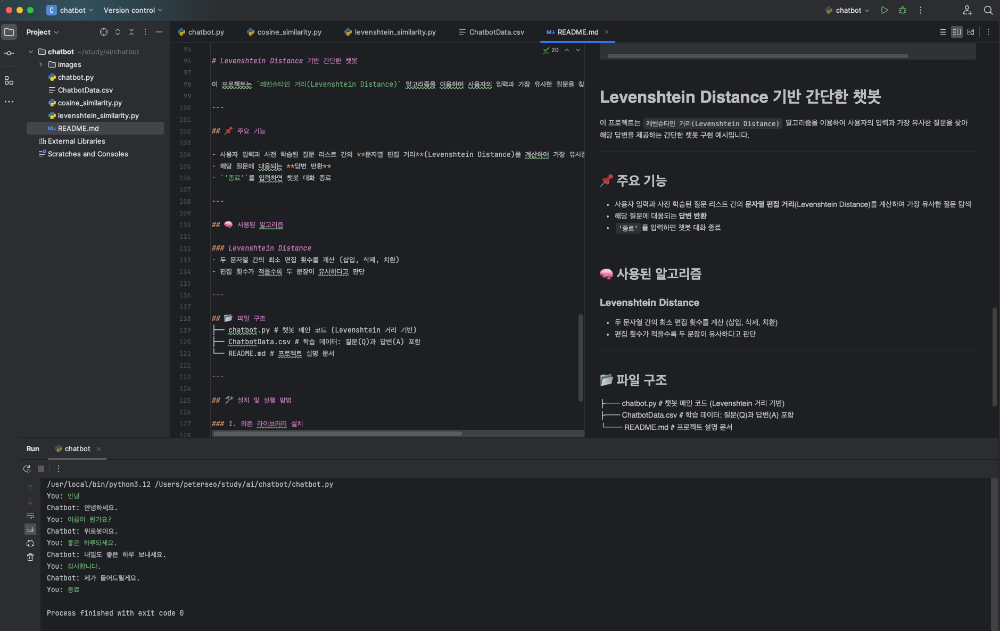

# 챗봇

## TF-IDF와 Cosine Similarity를 이용한 챗봇 구현

- 학습 데이터 셋 출처: (https://github.com/songys/Chatbot_data)


- TF-IDF 벡터화와 Cosine Similarity

- scikit-learn 설치

```
pip install scikit-learn
```

- cosine_similarity.py

```
from sklearn.feature_extraction.text import TfidfVectorizer
from sklearn.metrics.pairwise import cosine_similarity

# TfidfVectorizer 객체 생성
vectorizer = TfidfVectorizer()

# 한국어 문장들
sentence1 = "저는 오늘 밥을 먹었습니다."
sentence2 = "저는 어제 밥을 먹었습니다."

# 문장들을 벡터화
tfidf_matrix = vectorizer.fit_transform([sentence1, sentence2])

# 문장1과 문장2의 코사인 유사도 계산
cosine_sim = cosine_similarity(tfidf_matrix[0:1], tfidf_matrix[1:2])

print(f"문장 1: {sentence1}")
print(f"문장 2: {sentence2}")
print(f"두 문장의 코사인 유사도: {cosine_sim[0][0]}")

```

- 챗봇 구현

- chatbot.py 

```
import pandas as pd

# sklearn라는 머신러닝 라이브러리에서 TfidfVectorizer와 cosine_similarity를 불러옴
# TfidfVectorizer는 문서의 텍스트 데이터를 벡터 형태로 변환하는데 사용하며, cosine_similarity는 두 벡터 간의 코사인 유사도를 계산
from sklearn.feature_extraction.text import TfidfVectorizer
from sklearn.metrics.pairwise import cosine_similarity

# 챗봇 클래스를 정의
class SimpleChatBot:
    # 챗봇 객체를 초기화하는 메서드, 초기화 시에는 입력된 데이터 파일을 로드하고, TfidfVectorizer를 사용해 질문 데이터를 벡터화함
    def __init__(self, filepath):
        self.questions, self.answers = self.load_data(filepath)
        self.vectorizer = TfidfVectorizer()
        self.question_vectors = self.vectorizer.fit_transform(self.questions)

    # CSV 파일로부터 질문과 답변 데이터를 불러오는 메서드
    def load_data(self, filepath):
        data = pd.read_csv(filepath)
        questions = data['Q'].tolist()
        questions = data['A'].tolist()
        return questions, answers

    # 입력 문장에 가장 잘 맞는 답변을 찾는 메서드, 입력 문장을 벡터화하고, 이를 기존 질문 벡터들과 비교하여 가장 높은 유사도를 가진 질문의 답변을 반환함
    def find_best_answer(self, input_sentence):
        # 사용자 입력 문장을 벡터화
        input_vector = self.vectorizer.transform([input_sentence])
        # 사용자 입력 벡터와 기존 질문 벡터들 간의 코사인 유사도를 계산
        similarities = cosine_similarity(input_vector, self.question_vectors)
        # 가장 유사도가 높은 질문의 인덱스를 찾음
        best_match_index = similarities.argmax()
        # 가장 유사한 질문에 해당하는 답변을 반환
        return self.answers[best_match_index]

# 데이터 파일의 경로를 지정합니다.
filepath = 'ChatbotData.csv'

# 챗봇 객체를 생성합니다.
chatbot = SimpleChatBot(filepath)

# '종료'라는 입력이 나올 때까지 사용자의 입력에 따라 챗봇의 응답을 출력하는 무한 루프를 실행합니다.
while True:
    input_sentence = input('You: ')
    if input_sentence.lower() == '종료':
        break
    response = chatbot.find_best_answer(input_sentence)
    print('Chatbot:', response)

```

# Levenshtein Distance 기반 간단한 챗봇

이 프로젝트는 `레벤슈타인 거리(Levenshtein Distance)` 알고리즘을 이용하여 사용자의 입력과 가장 유사한 질문을 찾아 해당 답변을 제공하는 간단한 챗봇 구현 예시입니다.

---

## 📌 주요 기능

- 사용자 입력과 사전 학습된 질문 리스트 간의 **문자열 편집 거리**(Levenshtein Distance)를 계산하여 가장 유사한 질문 탐색
- 해당 질문에 대응되는 **답변 반환**
- `'종료'`를 입력하면 챗봇 대화 종료

---

## 🧠 사용된 알고리즘

### Levenshtein Distance
- 두 문자열 간의 최소 편집 횟수를 계산 (삽입, 삭제, 치환)
- 편집 횟수가 적을수록 두 문장이 유사하다고 판단

---

## 📂 파일 구조
├── chatbot.py # 챗봇 메인 코드 (Levenshtein 거리 기반)  
├── ChatbotData.csv # 학습 데이터: 질문(Q)과 답변(A) 포함  
└── README.md # 프로젝트 설명 문서

---

## 🛠️ 설치 및 실행 방법

### 1. 의존 라이브러리 설치

```bash
pip install pandas python-Levenshtein
```

### 2. 실행 예시

